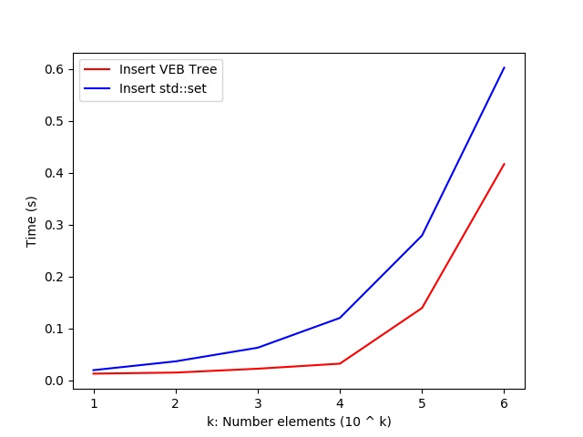
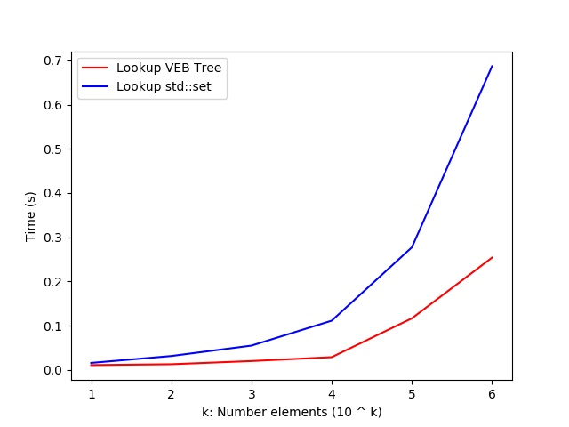
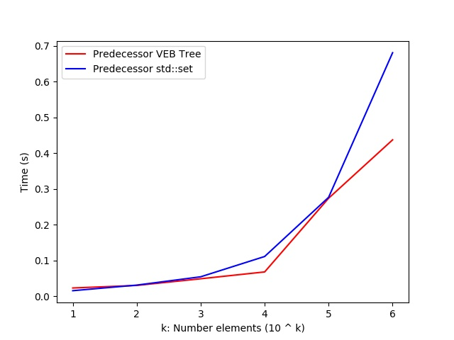
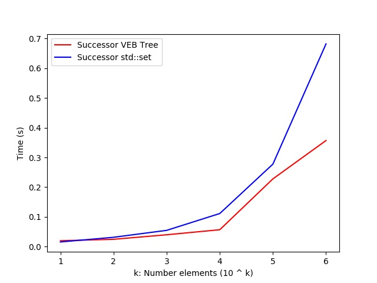
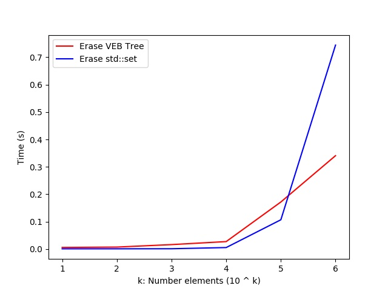

# Van Emde Boas Tree

Requirements
-------------
* [GTest](https://github.com/google/googletest)


Testing
-------------


```bash
make test
./test
```

Functions implemented
----------

* vEBTree (int n) - O(n)
* int min_element () - O(1)
* int max_element () - O(1)
* bool is_empty () - O(1)
* void insert (int x) - O(log log n)
* bool lookup (int x) - O(log log n)
* int successor (int x) - O(log log n)
* int predecessor (int x) - O(log log n)
* void erase (int x) - O(log log n)

Comparison
---------
In order to understand how efficient this structure is, I create a script that
compares the operations insert, lookup, successor, predecessor and erase
using and VEB tree and a set from the standard library.

In the script we receive the number of elements 'n' to work with number in [0, n).
Then we create a VEB Tree and a set and insert 1e6 random numbers to them.
After that we execute the mentioned operations (except insert that was execute to populate the structures) 
with 1e6 random numbers and we take the time when doing these operations.

We do the the above procedure 100 times and finally take the promedy of the times taken and output
the results in a table using Markdown style. 

You can execute the script with these commands

```bash
make comparison
# ./comparison <number_element>
# example
./comparison 100
```

The script was execute for n = [1e1](./times/time-10.md), [1e2](./times/time-100.md), 
[1e3](./times/time-1000.md), [1e4](./times/time-10000.md),
[1e5](./times/time-100000.md), [1e6](./times/time-1000000.md)


These result can be summarized in the following graphics:











As we can see from these graphics, VEB Tree has better performance than the std::set (witch is a Red Black Tree) for all the operations except erase in this scenario. In the operation erase we can se that VEB Tree is better than std::set just when n = 1e6. Moreover the graphics allows us to infer that the difference will just increases as n becomes greater. But for n > 1e6 we may get in trouble with the memory comsumption, so I did not run the script for these values. I we would like to reduce the memory comsumption we could make the optimizations suggested in the MIT's lecture. For example, we could create vEBTree nodes just when necessary using a hash table (unordered_map).

References
---------
* [MIT OpenCourseWare - Divide & Conquer: van Emde Boas Trees](https://www.youtube.com/watch?v=hmReJCupbNU)
* [GeeksForGeeks - Van Emde Boas Tree](https://www.geeksforgeeks.org/van-emde-boas-tree-set-4-deletion/)
* [Stanfod - van Emde Boas Trees](http://web.stanford.edu/class/archive/cs/cs166/cs166.1146/lectures/14/Small14.pdf)
